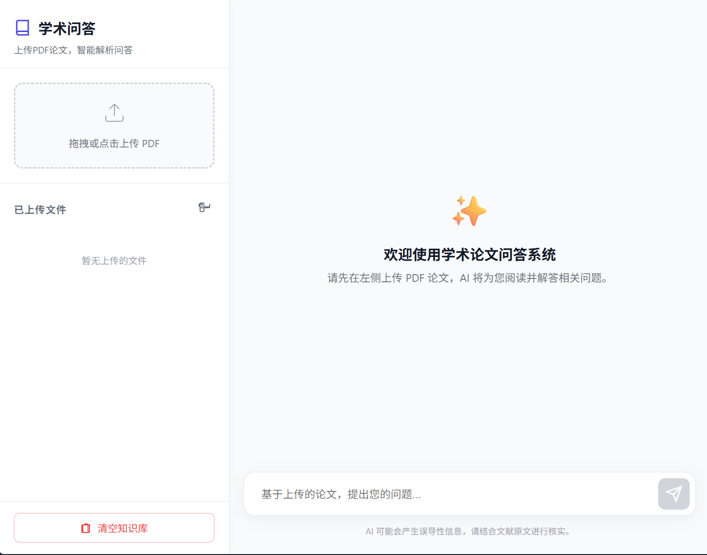

# 学术论文问答系统 (RAG)

基于检索增强生成(RAG)技术的学术论文智能问答系统，支持PDF论文上传、向量化存储和智能问答。

## ✨ 功能特性

- 📄 **PDF上传与解析**：支持拖拽或点击上传PDF文件，自动提取文本并分块
- 🔍 **智能向量检索**：使用FAISS向量数据库进行高效相似度检索
- 💬 **流式问答**：实时显示AI生成的答案，支持Markdown渲染
- 📚 **引用来源**：答案自动标注文献来源（文件名和页码）
- 🗂️ **文件管理**：支持查看已上传文件列表、删除单个文件、清除所有数据
- 📱 **响应式设计**：适配手机和桌面设备

## 🛠️ 技术栈

- 🐍 **后端**：Python + FastAPI
- 🌐 **前端**：原生HTML/CSS/JavaScript
- 🗄️ **向量数据库**：FAISS（本地持久化）
- 🤖 **大语言模型**：DeepSeek API（流式）
- 🧠 **嵌入模型**：`sentence-transformers/all-MiniLM-L6-v2`
- 📕 **PDF解析**：PyMuPDF (fitz)
- ✂️ **文本分块**：LangChain `RecursiveCharacterTextSplitter`

## 📁 项目结构

```
academic-rag/
├── app.py                    # FastAPI主应用
├── config.py                 # 配置文件
├── embedding.py              # 嵌入模型封装
├── vector_store.py           # FAISS向量数据库
├── pdf_processor.py          # PDF处理器
├── llm.py                   # LLM调用封装
├── requirements.txt          # 依赖清单
├── .env.example            # 环境变量示例
├── static/
│   ├── index.html           # 前端页面
│   ├── style.css            # 样式文件
│   └── script.js           # 交互脚本
├── uploads/                # 上传目录（自动创建）
└── vector_db/              # 向量数据库（自动创建）
```

## 🚀 快速开始

### 1️⃣ 环境准备

```bash
# 创建虚拟环境
python -m venv venv

# 激活虚拟环境
# Windows:
.\venv\Scripts\activate
# Linux/Mac:
source venv/bin/activate

# 安装依赖
pip install -r requirements.txt
```

### 2️⃣ 配置API密钥

```bash
# 复制环境变量示例文件
cp .env.example .env

# 编辑 .env 文件，填入您的DeepSeek API密钥
DEEPSEEK_API_KEY=your_deepseek_api_key_here
```

### 3️⃣ 启动应用

```bash
python app.py
```

### 4️⃣ 访问系统

打开浏览器访问：`http://localhost:8000`

## 📖 使用说明

### 📤 上传PDF

1. 点击上传区域或拖拽PDF文件到上传区域
2. 等待文件解析完成（首次运行会下载嵌入模型，约90MB）
3. 系统会显示"文件已处理，可以开始提问"

### 💭 问答操作

1. 在输入框中输入问题
2. 点击发送按钮或按回车键
3. 系统会实时显示AI生成的答案
4. 答案末尾会标注引用来源

### 🗂️ 文件管理

- 👀 **查看文件**：页面显示已上传的PDF文件列表，包含文件名、文档块数量和上传时间
- 🗑️ **删除单个文件**：点击文件旁边的删除按钮，删除指定PDF文件及其索引
- 🧹 **清除所有数据**：点击右上角的"清除数据"按钮，清除所有上传的PDF文件和向量数据库

## ⚙️ 配置说明

### 🔧 基本配置

在 `config.py` 中可以调整以下参数：

```python
UPLOAD_DIR = "uploads"                    # 上传目录
VECTOR_DB_DIR = "vector_db"               # 向量数据库目录
COLLECTION_NAME = "academic_papers"        # 集合名称
CHUNK_SIZE = 1000                        # 文本块大小
CHUNK_OVERLAP = 200                      # 文本块重叠
TOP_K = 5                               # 检索结果数量
EMBEDDING_MODEL = "sentence-transformers/all-MiniLM-L6-v2"  # 嵌入模型
DEEPSEEK_API_KEY = ""                     # DeepSeek API密钥
DEEPSEEK_API_URL = "https://api.deepseek.com/v1/chat/completions"  # DeepSeek API地址
```

### 🔄 更换LLM API提供商

系统支持更换不同的LLM API提供商，只需修改 `config.py` 和 `llm.py`：

#### 🤖 使用OpenAI API

**config.py:**
```python
DEEPSEEK_API_KEY = "your_openai_api_key"
DEEPSEEK_API_URL = "https://api.openai.com/v1/chat/completions"
```

**llm.py:**
```python
async def stream_llm_response(messages: List[Dict], model="gpt-3.5-turbo"):
```

#### 🔌 使用其他兼容OpenAI格式的API

许多API提供商（如Azure OpenAI、Anthropic等）都兼容OpenAI格式：

**config.py:**
```python
DEEPSEEK_API_KEY = "your_api_key"
DEEPSEEK_API_URL = "https://your-api-provider.com/v1/chat/completions"
```

**llm.py:**
```python
async def stream_llm_response(messages: List[Dict], model="your-model-name"):
```

### 🧠 更换嵌入模型

支持Hugging Face上的任何sentence-transformers模型：

**config.py:**
```python
# 多语言模型
EMBEDDING_MODEL = "sentence-transformers/paraphrase-multilingual-MiniLM-L12-v2"

# 更高精度
EMBEDDING_MODEL = "sentence-transformers/all-mpnet-base-v2"

# 中文优化模型
EMBEDDING_MODEL = "moka-ai/m3e-base"
```

**⚠️ 注意事项：**
- 更换嵌入模型后，需要删除 `vector_db/` 目录
- 重新上传PDF文件以重新建立向量索引
- 不同模型的向量维度不同，必须重新处理PDF文件

## 🔌 API接口

### POST /upload

上传PDF文件

**请求：**
- Content-Type: `multipart/form-data`
- 参数：`file` (PDF文件)

**响应：**
```json
{
  "message": "文件 xxx.pdf 已成功处理，共 50 个文档块",
  "filename": "xxx.pdf",
  "chunks": 50
}
```

### GET /files

获取已上传的文件列表

**响应：**
```json
{
  "files": [
    {
      "filename": "paper1.pdf",
      "chunks": 120,
      "upload_time": "2024-01-15 14:30"
    }
  ]
}
```

### DELETE /files/{filename}

删除指定的PDF文件

**参数：**
- `filename`: 文件名（路径参数）

**响应：**
```json
{
  "message": "文件 paper1.pdf 已删除"
}
```

### DELETE /clear

清除所有上传的PDF文件和向量数据库

**响应：**
```json
{
  "message": "已清除所有上传的PDF文件和向量数据库"
}
```

### POST /ask

提问

**请求：**
```json
{
  "question": "论文的主要贡献是什么？"
}
```

**响应：**
- Content-Type: `text/plain`
- 流式返回答案文本

## ❓ 常见问题

### Q: 嵌入模型和LLM的选择对问答效果有何影响？
A: 模型选择直接影响检索和生成质量：
嵌入模型（用于检索）：决定能否找到相关段落。
若用中文提问但论文是英文，必须用多语言嵌入模型（如 paraphrase-multilingual-MiniLM-L12-v2），否则会检索失败（回答"文献中未提及"但实际内容存在）。

### Q: 上传PDF后提示"无法从PDF中提取文本内容"？
A: 请确保PDF是可复制文本的常规PDF，扫描版图片无法提取文本。

### Q: 首次启动很慢？
A: 首次运行需要下载嵌入模型（约90MB），后续启动会使用缓存。

### Q: 问答时提示"文献中未找到相关内容"？
A: 请确保已上传相关论文，或者尝试调整问题表述。

### Q: 如何更换嵌入模型？
A: 修改 `config.py` 中的 `EMBEDDING_MODEL` 参数，支持Hugging Face上的任何sentence-transformers模型。更换后需删除 `vector_db/` 目录并重新上传PDF。

### Q: 如何更换LLM API提供商？
A: 修改 `config.py` 中的 `DEEPSEEK_API_KEY` 和 `DEEPSEEK_API_URL`，以及 `llm.py` 中的模型参数。支持OpenAI、Azure OpenAI等兼容格式的API。

### Q: 支持哪些嵌入模型？
A: 支持Hugging Face上的所有sentence-transformers模型，如：
- `sentence-transformers/all-MiniLM-L6-v2`（默认，轻量）
- `sentence-transformers/paraphrase-multilingual-MiniLM-L12-v2`（多语言）
- `sentence-transformers/all-mpnet-base-v2`（高精度）
- `moka-ai/m3e-base`（中文优化）

### Q: 更换嵌入模型后需要做什么？
A: 需要删除 `vector_db/` 目录，然后重新上传PDF文件以重新建立向量索引。

## ⚠️ 注意事项

1. 🧠 **嵌入模型**：首次运行时会自动下载嵌入模型（约90MB），请确保网络通畅
2. 📄 **PDF格式**：上传的PDF文件需为可复制文本的常规PDF，扫描版无法提取内容
3. 🔑 **API密钥**：DeepSeek API调用需要有效的API密钥
4. 🐍 **Python版本**：推荐使用Python 3.10-3.13，Python 3.14可能存在兼容性问题
5. 🌐 **网络要求**：需要访问Hugging Face下载嵌入模型

## 💻 二次开发说明

### ➕ 添加新功能

1. 修改 `app.py` 添加新的API路由
2. 修改 `static/` 下的前端文件更新界面
3. 修改 `config.py` 添加新的配置参数

### 🐛 调试模式

在 `app.py` 中设置：
```python
app = FastAPI(title="学术论文问答系统", debug=True)
```

## 📜 许可证

MIT License
